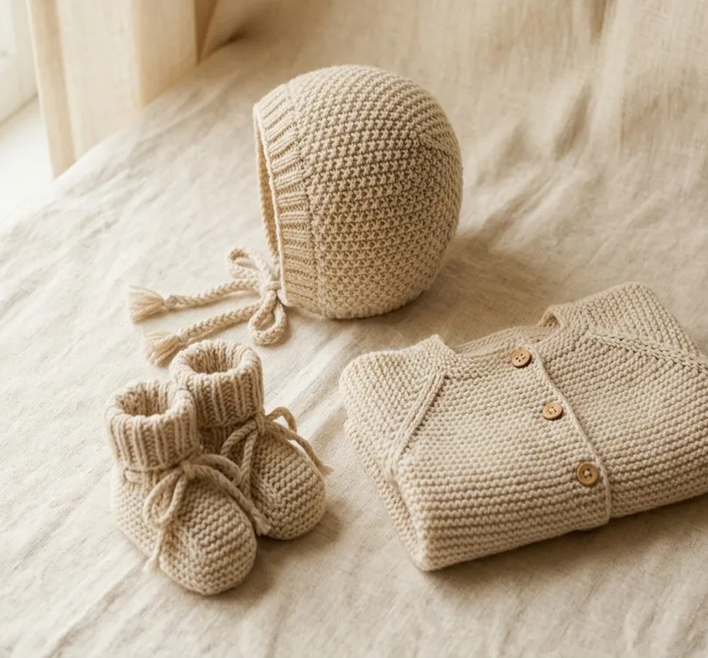
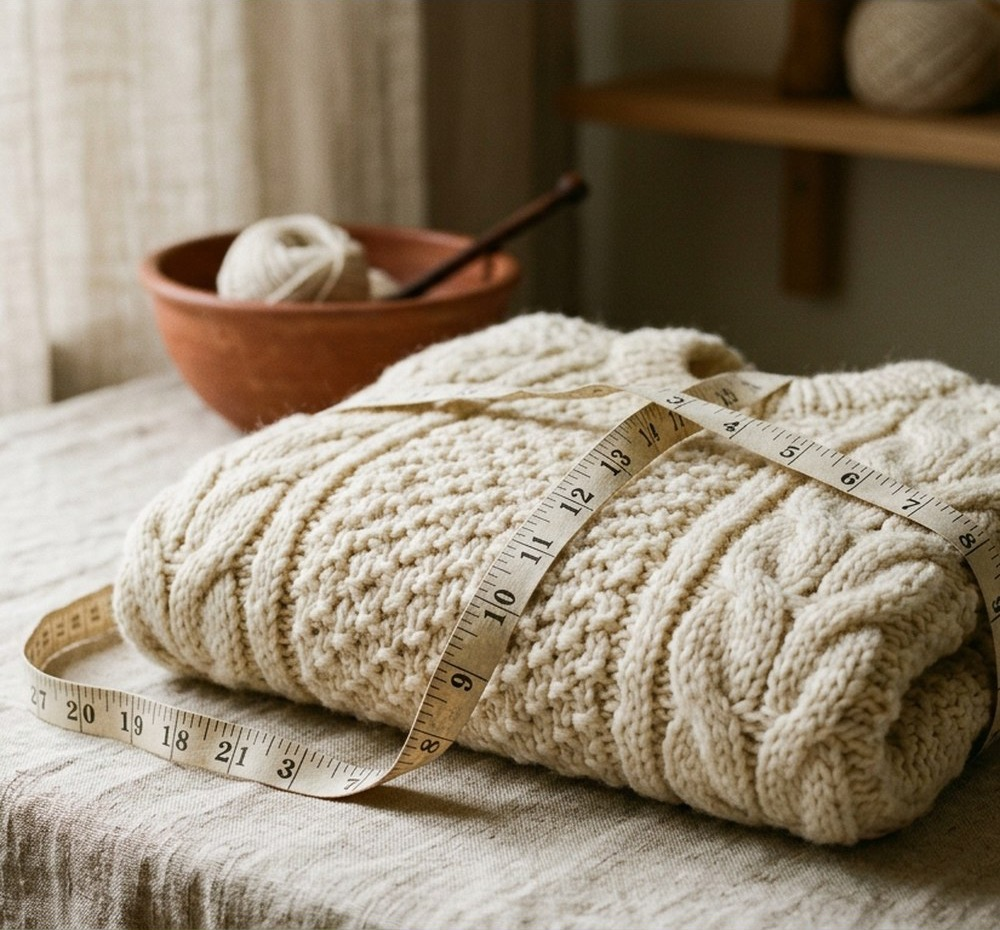
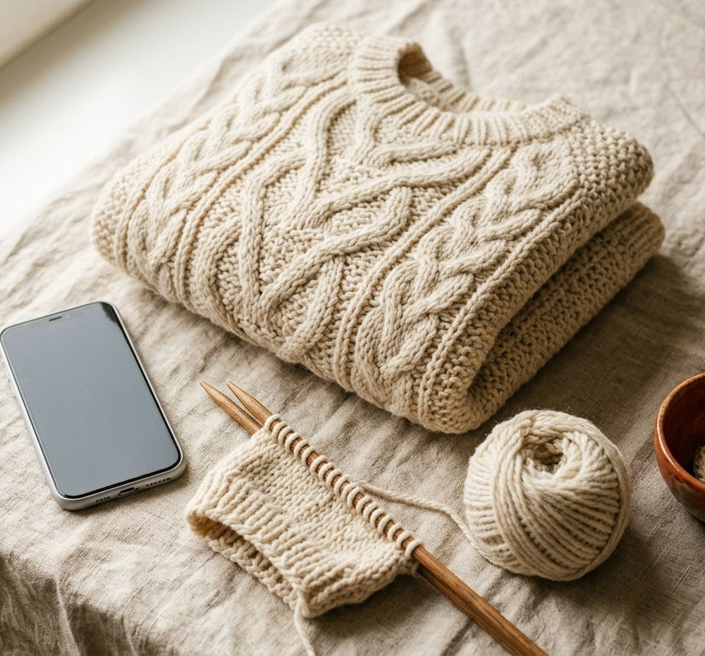
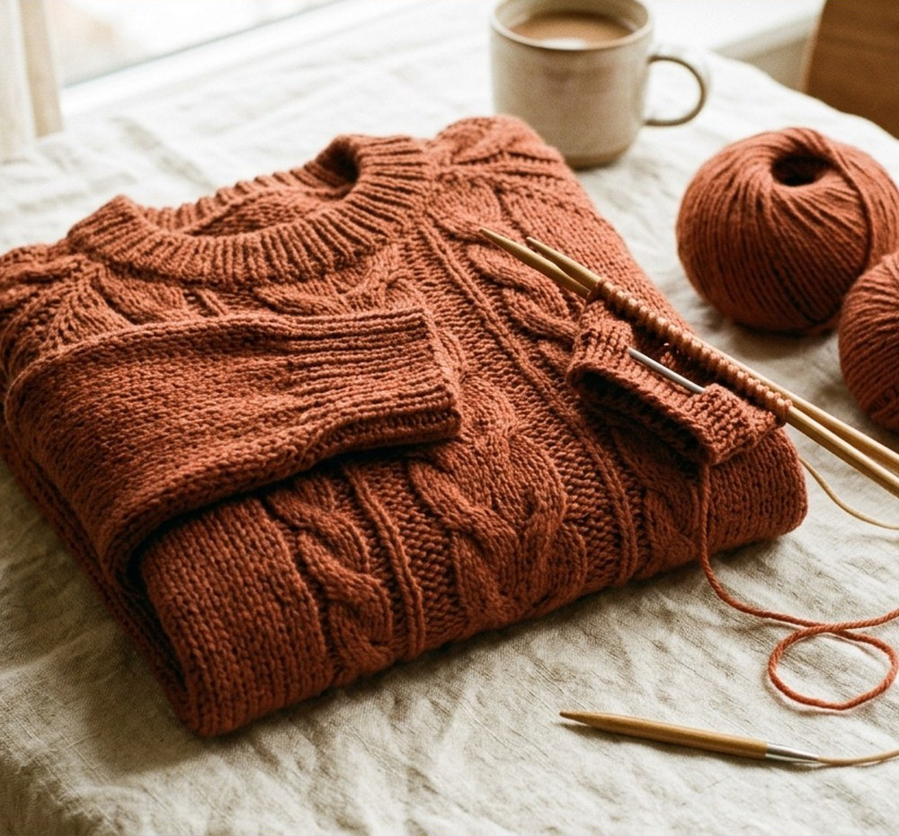

# A/B analyse photo : claude-opus-5 vs kimi-k3

Généré le 2026-08-06 07:27 par `scripts/diag-ab-kimi.ts`.

Même system prompt (extrait de `lib/anthropic.ts`, 5112 caractères), même construction de message que la prod (image base64 puis prompt texte), max_tokens 8192. Kimi : temperature 1 (imposée par le modèle), API OpenAI-compatible Moonshot.

Tarifs utilisés ($/M tokens input/output) : Opus 5 = 5/25, Kimi K3 = 3/15.

## Contexte du test

**Images de test** : aucune vraie photo utilisateur n'existe dans le repo (pas de fixtures, les uploads vivent dans Supabase Storage). Les 4 images sont tirées des visuels Pinterest de marque (`public/pins/`, générés par gemini-3.1), recadrées pour retirer les bandeaux de texte marketing (sips, crop 1000x930). Ce sont des photos réalistes de tricots (pull torsadé rouille, pull irlandais écru, pull écru plié avec mètre ruban, layette avec cardigan à boutons) mais pas des photos utilisateur réelles : à compléter idéalement avec 2-3 vraies photos d'uploads si un second run est fait.

**Déroulé** : côté Opus 5 exécuté le 2026-08-06 au matin ; côté Kimi K3 complété le même jour une fois la clé Moonshot posée dans `~/.config/moonshot/key`. Les deux côtés sont en cache dans `tasks/ab-kimi-results/` : relancer le script ne refacture rien, ajouter une image dans le dossier ne facture que les nouveaux appels.

## Synthèse

| Image | Modèle | Statut | Latence | Tokens in/out | Coût | JSON valide | Champs "unknown" | Confiance globale |
|---|---|---|---|---|---|---|---|---|
| layette-cardigan | claude-opus-5 | ok | 10.5 s | 3581 / 661 | $0.0344 | oui | 3 | low |
| layette-cardigan | kimi-k3 | ok | 40.3 s | 2975 / 917 | $0.0227 | oui | 4 | medium |
| pull-ecru-plie | claude-opus-5 | ok | 9.9 s | 3581 / 634 | $0.0338 | oui | 10 | low |
| pull-ecru-plie | kimi-k3 | ok | 31.0 s | 2975 / 813 | $0.0211 | oui | 10 | low |
| pull-irlandais-ecru | claude-opus-5 | ok | 10.4 s | 3581 / 642 | $0.0340 | oui | 4 | low |
| pull-irlandais-ecru | kimi-k3 | ok | 39.6 s | 2975 / 1043 | $0.0246 | oui | 4 | medium |
| pull-torsades-rouille | claude-opus-5 | ok | 13.9 s | 3581 / 602 | $0.0330 | oui | 2 | medium |
| pull-torsades-rouille | kimi-k3 | ok | 42.8 s | 2975 / 1286 | $0.0282 | oui | 2 | medium |

**claude-opus-5** : 4/4 analyses ok, latence moyenne 11.2 s, coût total $0.1351 (moyenne $0.0338/analyse).

**kimi-k3** : 4/4 analyses ok, latence moyenne 38.4 s, coût total $0.0966 (moyenne $0.0241/analyse).

## Détail par image

### layette-cardigan



#### claude-opus-5
Latence 10.5 s, 3581/661 tokens, $0.0344.

```json
{
  "analysable": true,
  "rejectionReason": null,
  "garment": {
    "type": "cardigan",
    "confidence": 0.9
  },
  "construction": {
    "method": "unknown",
    "confidence": 0.3,
    "reasoning": "Le vêtement est plié, ce qui masque les lignes de construction. On devine une ligne d'épaule/emmanchure sur le côté droit de l'image qui pourrait évoquer des manches montées ou une construction en pièces assemblées, mais l'ensemble en point mousse rend l'identification incertaine."
  },
  "neckline": {
    "type": "ouvert-cardigan",
    "confidence": 0.7
  },
  "neckband": {
    "construction": "picked-up",
    "height": "basse",
    "stitch": "mousse",
    "confidence": 0.4
  },
  "sleeves": {
    "type": "unknown",
    "length": "longues",
    "confidence": 0.4
  },
  "stitch": {
    "mainPattern": "mousse",
    "confidence": 0.85,
    "notes": "Point mousse (rangs de bosses horizontales) sur l'ensemble du corps ; la bande de boutonnage semble également en mousse ou jersey."
  },
  "closure": {
    "type": "boutons",
    "buttonCountEstimate": 3,
    "confidence": 0.85
  },
  "fit": {
    "style": "unknown",
    "confidence": 0.2
  },
  "limitations": [
    "Le vêtement est plié : impossible de voir l'encolure complète, les manches et la longueur totale",
    "Impossible de déterminer la méthode de construction (top-down, bottom-up, pièces assemblées)",
    "Impossible de vérifier si la bordure d'encolure est doublée",
    "Le nombre total de boutons peut être supérieur (partie inférieure masquée par le pli)"
  ],
  "warnings": [
    "Il s'agit probablement d'un vêtement de bébé (ensemble avec béguin et chaussons)",
    "L'analyse repose sur une vue partielle du vêtement plié"
  ],
  "overallConfidence": "low"
}
```

#### kimi-k3
Latence 40.3 s, 2975/917 tokens, $0.0227.

```json
{
  "analysable": true,
  "rejectionReason": null,
  "garment": {
    "type": "cardigan",
    "confidence": 0.85
  },
  "construction": {
    "method": "unknown",
    "confidence": 0.3,
    "reasoning": "Le vêtement est plié, ce qui empêche de voir la construction. De légères lignes diagonales près de l'encolure suggèrent un raglan, possiblement tricoté en top-down, mais cela reste incertain."
  },
  "neckline": {
    "type": "ras-du-cou",
    "confidence": 0.4
  },
  "neckband": {
    "construction": "unknown",
    "height": "basse",
    "stitch": "mousse",
    "doubled": null,
    "confidence": 0.3
  },
  "sleeves": {
    "type": "unknown",
    "length": "unknown",
    "confidence": 0.2
  },
  "stitch": {
    "mainPattern": "mousse",
    "confidence": 0.9,
    "notes": "Point mousse régulier sur tout le vêtement, avec des bordures en côtes visibles sur les accessoires assortis (bonnet et chaussons)."
  },
  "closure": {
    "type": "boutons",
    "buttonCountEstimate": 3,
    "confidence": 0.9
  },
  "fit": {
    "style": "regular",
    "confidence": 0.5
  },
  "limitations": [
    "Le cardigan est plié: impossible de voir les manches, la longueur totale et la construction exacte",
    "L'encolure est partiellement masquée par le pliage",
    "La construction de la bordure d'encolure n'est pas visible",
    "Le nombre total de boutons pourrait être supérieur (partie basse masquée)",
    "L'image montre un ensemble (bonnet, chaussons, cardigan): l'analyse porte uniquement sur le cardigan"
  ],
  "warnings": [
    "Vêtement de bébé: les proportions diffèrent des vêtements adultes",
    "Analyse basée sur un vêtement plié, fiabilité réduite pour la construction et les manches"
  ],
  "overallConfidence": "medium"
}
```

### pull-ecru-plie



#### claude-opus-5
Latence 9.9 s, 3581/634 tokens, $0.0338.

```json
{
  "analysable": true,
  "rejectionReason": null,
  "garment": {
    "type": "unknown",
    "confidence": 0.3,
    "notes": null
  },
  "construction": {
    "method": "unknown",
    "confidence": 0.1,
    "reasoning": "Le vêtement est plié et enroulé, aucune couture d'épaule, emmanchure ou ligne de construction n'est visible."
  },
  "neckline": {
    "type": "unknown",
    "confidence": 0.1
  },
  "neckband": {
    "construction": "unknown",
    "height": "unknown",
    "stitch": "unknown",
    "doubled": null,
    "confidence": 0.1
  },
  "sleeves": {
    "type": "unknown",
    "length": "unknown",
    "confidence": 0.1
  },
  "stitch": {
    "mainPattern": "torsades",
    "confidence": 0.85,
    "notes": "Tricot type aran en laine épaisse : panneaux de torsades entrelacées alternant avec des panneaux de point de riz/point de blé, séparés par des colonnes de mailles endroit. Couleur écrue naturelle."
  },
  "closure": {
    "type": "unknown",
    "buttonCountEstimate": 0,
    "confidence": 0.15
  },
  "fit": {
    "style": "unknown",
    "confidence": 0.1
  },
  "limitations": [
    "Le vêtement est plié : impossible de déterminer sa forme générale (pull, cardigan ou gilet)",
    "Encolure non visible : type de col et bordure indéterminables",
    "Manches non visibles : type et longueur indéterminables",
    "Aucune fermeture ni bouton visible sur la partie exposée",
    "Méthode de construction non identifiable sans coutures ni empiècement visibles"
  ],
  "warnings": [
    "Analyse limitée au point de tricot uniquement",
    "Une photo du vêtement déplié et à plat (vue de face et de dos) est nécessaire pour une analyse complète"
  ],
  "overallConfidence": "low"
}
```

#### kimi-k3
Latence 31.0 s, 2975/813 tokens, $0.0211.

```json
{
  "analysable": true,
  "rejectionReason": null,
  "garment": {
    "type": "unknown",
    "confidence": 0.3
  },
  "construction": {
    "method": "unknown",
    "confidence": 0.1,
    "reasoning": "Le vêtement est plié/roulé, aucune ligne de construction (épaules, emmanchures, coutures) n'est visible pour déterminer la méthode."
  },
  "neckline": {
    "type": "unknown",
    "confidence": 0
  },
  "neckband": {
    "construction": "unknown",
    "height": "unknown",
    "stitch": "unknown",
    "doubled": null,
    "confidence": 0
  },
  "sleeves": {
    "type": "unknown",
    "length": "unknown",
    "confidence": 0.1
  },
  "stitch": {
    "mainPattern": "torsades",
    "confidence": 0.85,
    "notes": "Larges torsades tressées visibles sur toute la surface, alternant avec des panneaux texturés (point de riz ou similaire). Fil épais écru, tricot type irlandais (aran)."
  },
  "closure": {
    "type": "unknown",
    "buttonCountEstimate": 0,
    "confidence": 0.2
  },
  "fit": {
    "style": "unknown",
    "confidence": 0.1
  },
  "limitations": [
    "Vêtement plié et roulé : impossible d'identifier le type exact (pull, cardigan, gilet)",
    "Encolure non visible : type de col et bordure d'encolure indéterminables",
    "Manches non visibles : type et longueur indéterminables",
    "Fermeture non visible : aucun bouton visible sur les parties exposées, mais le devant peut être caché",
    "Méthode de construction indéterminable (pas de coutures ou épaules visibles)",
    "Coupe et taille indéterminables"
  ],
  "warnings": [
    "L'analyse se limite au point de tricot : torsades style aran avec panneaux texturés",
    "Le mètre ruban suggère une photo de contexte tricot artisanal, pas une présentation du vêtement à plat"
  ],
  "overallConfidence": "low"
}
```

### pull-irlandais-ecru



#### claude-opus-5
Latence 10.4 s, 3581/642 tokens, $0.0340.

```json
{
  "analysable": true,
  "rejectionReason": null,
  "garment": {
    "type": "pull",
    "confidence": 0.85
  },
  "construction": {
    "method": "unknown",
    "confidence": 0.3,
    "reasoning": "Le pull est plié, on ne voit ni les emmanchures ni les lignes d'augmentation. Les motifs de torsades verticaux suggèrent une construction bottom-up ou en pièces assemblées, mais rien ne permet de trancher."
  },
  "neckline": {
    "type": "ras-du-cou",
    "confidence": 0.75
  },
  "neckband": {
    "construction": "picked-up",
    "height": "basse",
    "stitch": "cotes-1x1",
    "doubled": null,
    "confidence": 0.5
  },
  "sleeves": {
    "type": "unknown",
    "length": "unknown",
    "confidence": 0.2
  },
  "stitch": {
    "mainPattern": "torsades",
    "confidence": 0.9,
    "notes": "Motif de type aran : torsades centrales entrelacées, tresses et losanges sur fond de point mousse/jersey envers. Bordure inférieure en côtes."
  },
  "closure": {
    "type": "aucune",
    "buttonCountEstimate": 0,
    "confidence": 0.8
  },
  "fit": {
    "style": "unknown",
    "confidence": 0.25
  },
  "limitations": [
    "Le vêtement est plié : type et longueur des manches non visibles",
    "Impossible de déterminer la méthode de construction (emmanchures et épaules masquées)",
    "Coupe/aisance non évaluable sur un vêtement plié",
    "Dos et éventuelle ouverture arrière non visibles",
    "Double épaisseur du col non vérifiable"
  ],
  "warnings": [
    "L'encolure n'est que partiellement visible : le type ras-du-cou est une déduction",
    "L'analyse du col (hauteur, point) est approximative en raison de l'angle de prise de vue"
  ],
  "overallConfidence": "low"
}
```

#### kimi-k3
Latence 39.6 s, 2975/1043 tokens, $0.0246.

```json
{
  "analysable": true,
  "rejectionReason": null,
  "garment": {
    "type": "pull",
    "confidence": 0.85
  },
  "construction": {
    "method": "unknown",
    "confidence": 0.2,
    "reasoning": "Le vêtement est plié, il est impossible de voir les coutures d'assemblage, les épaules ou la structure générale pour déterminer la méthode de construction."
  },
  "neckline": {
    "type": "ras-du-cou",
    "confidence": 0.6
  },
  "neckband": {
    "construction": "picked-up",
    "height": "basse",
    "stitch": "cotes-1x1",
    "doubled": null,
    "confidence": 0.45
  },
  "sleeves": {
    "type": "unknown",
    "length": "unknown",
    "confidence": 0.1
  },
  "stitch": {
    "mainPattern": "torsades",
    "confidence": 0.95,
    "notes": "Motif de torsades multiples bien visibles sur toute la surface, alternant avec des bandes de jersey envers. Laine épaisse de type aran/chunky, couleur écru."
  },
  "closure": {
    "type": "aucune",
    "buttonCountEstimate": 0,
    "confidence": 0.9
  },
  "fit": {
    "style": "unknown",
    "confidence": 0.2
  },
  "limitations": [
    "Le vêtement est plié, ce qui empêche de voir les manches (type et longueur indéterminables)",
    "La méthode de construction ne peut pas être déterminée sans voir les coutures ou les épaules",
    "La coupe et la silhouette ne peuvent pas être évaluées sur un vêtement plié",
    "La construction exacte du col (relevé ou cousu) est difficile à confirmer sur cette vue",
    "Impossible de déterminer si le col est doublé",
    "La longueur du corps n'est pas visible"
  ],
  "warnings": [
    "Analyse limitée par la présentation du vêtement plié à plat",
    "La présence d'accessoires (aiguilles, pelote, échantillon) suggère une mise en scène plutôt qu'un vêtement porté"
  ],
  "overallConfidence": "medium"
}
```

### pull-torsades-rouille



#### claude-opus-5
Latence 13.9 s, 3581/602 tokens, $0.0330.

```json
{
  "analysable": true,
  "rejectionReason": null,
  "garment": {
    "type": "pull",
    "confidence": 0.9
  },
  "construction": {
    "method": "unknown",
    "confidence": 0.3,
    "reasoning": "Le pull est plié, les lignes d'épaules et d'emmanchures ne sont pas visibles. Les torsades verticales suggèrent un tricot en rangs ou en rond de bas en haut, mais aucune ligne de raglan ni de couture d'épaule n'est identifiable."
  },
  "neckline": {
    "type": "ras-du-cou",
    "confidence": 0.85
  },
  "neckband": {
    "construction": "picked-up",
    "height": "basse",
    "stitch": "cotes-1x1",
    "doubled": false,
    "confidence": 0.65
  },
  "sleeves": {
    "type": "unknown",
    "length": "longues",
    "confidence": 0.55
  },
  "stitch": {
    "mainPattern": "torsades",
    "confidence": 0.9,
    "notes": "Torsades verticales alternées avec des colonnes de jersey et des bandes de point mousse ou de côtes; poignets et bas en côtes."
  },
  "closure": {
    "type": "aucune",
    "buttonCountEstimate": 0,
    "confidence": 0.85
  },
  "fit": {
    "style": "regular",
    "confidence": 0.4
  },
  "limitations": [
    "Vêtement plié: impossible de voir les emmanchures, la forme des épaules et la longueur totale",
    "Type de montage des manches indéterminable",
    "Impossible de confirmer si la bordure d'encolure est doublée",
    "Coupe (ajustée/oversized) difficile à évaluer sans porté"
  ],
  "warnings": [
    "La construction (top-down/bottom-up) est une hypothèse non vérifiable sur cette photo"
  ],
  "overallConfidence": "medium"
}
```

#### kimi-k3
Latence 42.8 s, 2975/1286 tokens, $0.0282.

```json
{
  "analysable": true,
  "rejectionReason": null,
  "garment": {
    "type": "pull",
    "confidence": 0.9
  },
  "construction": {
    "method": "unknown",
    "confidence": 0.2,
    "reasoning": "Le vêtement est plié, impossible de déterminer la méthode de construction (top-down, bottom-up ou pièces assemblées). Aucune couture d'épaule ou indice de sens de montage visible."
  },
  "neckline": {
    "type": "ras-du-cou",
    "confidence": 0.85
  },
  "neckband": {
    "construction": "picked-up",
    "height": "basse",
    "stitch": "cotes-1x1",
    "doubled": false,
    "confidence": 0.6
  },
  "sleeves": {
    "type": "unknown",
    "length": "longues",
    "confidence": 0.5
  },
  "stitch": {
    "mainPattern": "torsades",
    "confidence": 0.95,
    "notes": "Grandes torsades bien définies entourées de panneaux en point texturé (jersey envers ou point de riz). Bordures en côtes aux poignets et à l'encolure."
  },
  "closure": {
    "type": "aucune",
    "buttonCountEstimate": 0,
    "confidence": 0.95
  },
  "fit": {
    "style": "regular",
    "confidence": 0.5
  },
  "limitations": [
    "Le vêtement est plié : la construction des épaules et l'emmanchure ne sont pas visibles",
    "Le dos du vêtement n'est pas visible",
    "L'ourlet du bas n'est pas visible",
    "Des aiguilles à tricoter et des pelotes masquent partiellement le vêtement",
    "Impossible de déterminer si le col est réellement relevé ou cousu avec certitude en raison du pliage",
    "La coupe exacte (ajustée vs regular) est difficile à évaluer sur un vêtement plié"
  ],
  "warnings": [
    "Vêtement photographié plié dans une mise en scène avec accessoires (tasse, pelotes, aiguilles)",
    "Analyse basée uniquement sur les parties visibles du devant et d'une manche"
  ],
  "overallConfidence": "medium"
}
```
